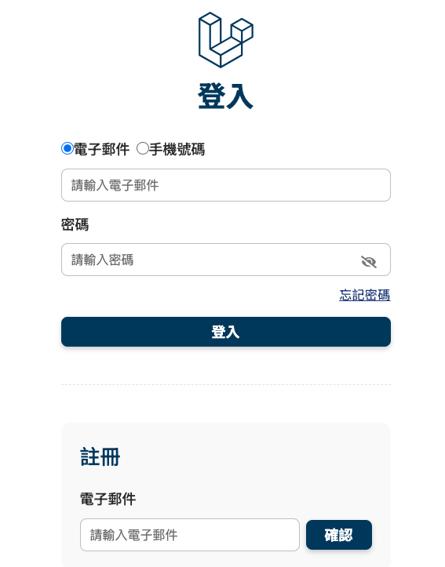
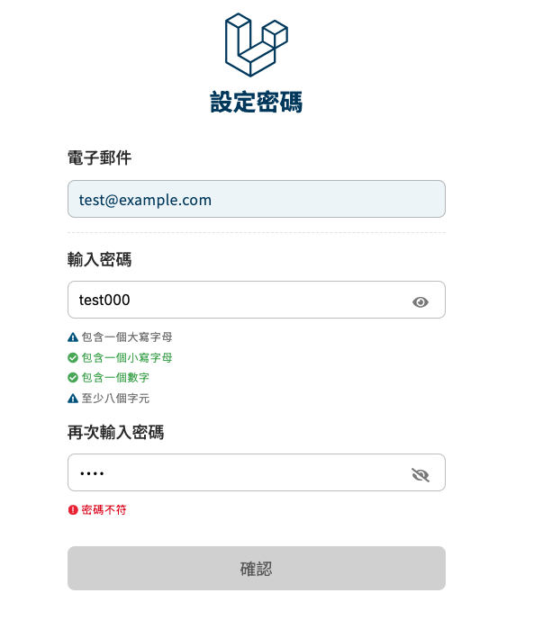
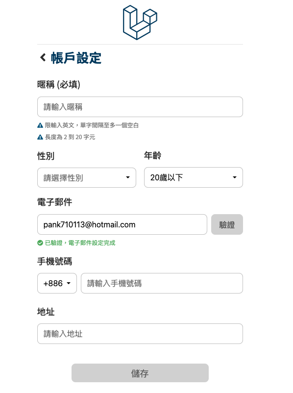
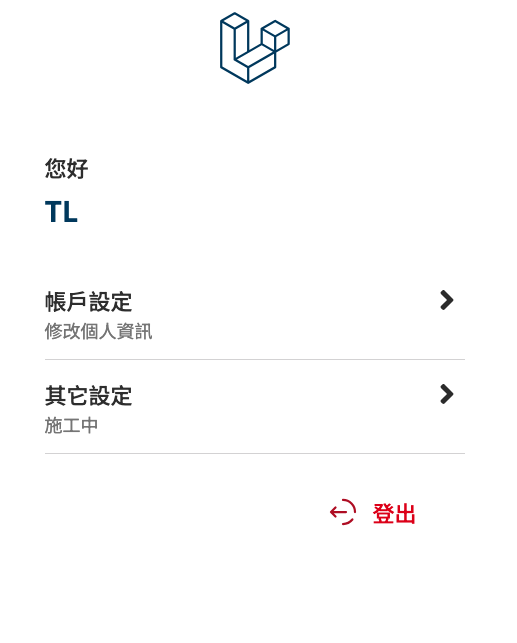

## 目錄

- [功能總覽](#功能總覽)
- [技術使用](#技術使用)
- [系統流程概覽](#系統流程概覽)
- [技能對應與實務經驗](#技能對應與實務經驗)
- [資料表設計](#資料表設計)
- [Controller 設計](#controller-設計)
- [Service Layer](#service-layer)
- [開發與執行教學 / 架構說明](#開發與執行教學--架構說明)

# Member System Demo

這是一個以 Laravel 12 開發的完整會員系統範例，包含註冊、登入、Email 驗證、資料編輯、忘記密碼等實用功能，  
並實作 AJAX 輪詢機制提升用戶體驗。  

專案採用清晰的 Service Layer 架構，符合實務開發需求，作為個人作品展示。

---

## 功能總覽

- 會員註冊（含 Email 驗證）
- 登入 / 登出
- 忘記密碼流程
- 個人資料設定（暱稱、性別、年齡層）
- Email 變更驗證流程
- 驗證信輪詢機制（AJAX + polling）

---

## 技術使用

- **後端框架**：Laravel 12（MVC 架構）
- **前端模板**：Blade + jQuery（含 AJAX 操作）
- **資料庫**：MySQL（使用 migration、seed）
- **部署環境**：MAMP / macOS
- **版本控制**：Git

---

## 系統流程概覽

本系統為「會員中心」，提供兩條主要操作流程：

1. **註冊流程**  
   `訪客點選註冊 → 發送驗證信 → 設定密碼 → 設定會員資料 → 首頁 → 登出`

2. **登入流程**  
   `登入 → 首頁 → 編輯會員資料（含變更 Email）→ 首頁 → 登出`

---

## 技能對應與實務經驗

以下為我在本專案中展現的技術能力

| 技能項目                     | 實作經驗與說明 |
|-----------------------------|--------------------|
| PHP / Laravel / MVC 架構     | 熟悉 Laravel ，專案以 MVC 架構撰寫，並清楚分離 Controller 與 Service。 |
| MySQL 資料庫設計              | 使用 migration 建立多張資料表，並利用 Seeder 匯入測試資料（Seeder 功能基礎實作中）。 |
| Eloquent ORM                | 熟悉條件查詢、關聯操作與 Model 驗證邏輯，於專案中廣泛使用。 |
| RESTful API 與 JSON 資料處理 | 實作 Email 驗證狀態查詢 API，採用 RESTful 設計與 JSON 格式回應。 |
| Git 版本控制                 | 使用 Git 管理專案版本，具備良好 commit 習慣，理解多人協作流程。 |
| jQuery 與 AJAX 操作          | 透過 jQuery 操作 DOM 並發送非同步請求，實作註冊、驗證信輪詢等功能。 |
| HTML / CSS / Blade 模板     | 使用 Blade 撰寫頁面結構，結合 CSS 呈現表單與版面，自主切版。 |
| 技術文件撰寫能力              | 本專案附有 README、安裝教學、流程與架構說明，文檔完整易讀。 |

---

## 系統畫面預覽

  
  

  
  

---

## 資料表設計

| Table 名稱                        |説明                                                   |
|----------------------------------|-------------------------------------------------------|
| member_center_guests             | 記錄尚未設定密碼的註冊訪客（含註冊驗證信 token）             |
| member_center_users              | 正式會員資料（含登入用 bearer token）                     |
| member_center_user_contact_update| Email/手機變更請求資料，追蹤變更狀態與驗證信（目前實作 Email）|
| member_center_password_update    | 忘記密碼的驗證 token 與狀態紀錄                           |

---

## Controller 設計

| Controller 名稱            | 負責功能說明                     |
|---------------------------|--------------------------------|
| MemberRegisterController  | 處理註冊流程與訪客記錄             |
| MemberCenterController    | 會員首頁與個人資料編輯             |
| UpdateContactController   | 處理 Email 更新流程              |
| ForgotPasswordController  | 忘記密碼流程（產生與驗證 token）    |
| PollingStatusController   | 提供前端輪詢 Email 驗證狀態的 API  |

---

### Service Layer

| Service 名稱                 | 職責簡介                                     |
|-----------------------------|---------------------------------------------|
| `MemberRegisterService`     | 處理註冊流程與訪客建立邏輯                       |
| `MemberLoginService`        | 登入驗證與登入 token 管理                      |
| `MemberAuthService`         | 驗證各類型 token：註冊、登入、Email 變更、密碼重設 |
| `ContactUpdateService`      | Email 變更申請流程與狀態控制                    |
| `MemberEmailService`        | 發送各種 Email（註冊、驗證、密碼重設）           |
| `ValidationService`         | 驗證 Email、手機等格式正確性                    |
| `MemberEditService`         | 編輯會員個人資料（暱稱、性別、年齡層）            |
| `ForgotPasswordService`     | 忘記密碼流程（產生/驗證 token、更新密碼）        |
| `PollingStatusService`      | 處理 Email 驗證輪詢狀態查詢                    |

---

## 開發與執行教學 / 架構說明

- 🛠 安裝流程請參考 👉 [`docs/setup.md`](docs/setup.md)  
- 🧩 系統架構與模組設計 👉 [`docs/architecture.md`](docs/architecture.md)

---

